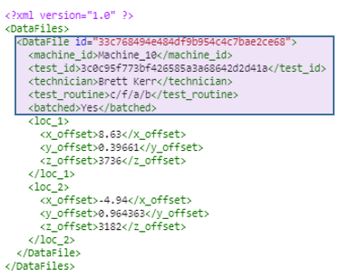

# XML Batch Data Processing

For decades xml was the dominate format main applications to communicate with one another. In recent years xml has become less and less popular a data format for semi-structured data cases. Now in modern cloud native, microservice applications json or yaml has become the norm. However this doesn't change the fact that much of the systems, tooling, and business process are still in place. XML is also the defacto 'neutral' format for converting industry specific file types. As a professional analyst being able process xml as easily as csv is a must.

In this post we'll create a batch data processing script for a typical lab reporting use case. The scenario, a technician, Susian, at the end of each day analyzes the departments test results. The lab equipment outputs test results as xml. Susian requires the xml to be converted into csv in order to feed an Excel report she was given.

I'll be using a sample lab-measurement-dataset I auto generated in a previous post [here](https://dev.to/darrylbrysondev0/auto-generate-lab-measurement-dataset-59kb). 

**Conents**
- [XML Batch Data Processing](#xml-batch-data-processing)
  - [Convert XML to CSV](#convert-xml-to-csv)
    - [Parsing XML](#parsing-xml)
  - [Batch Execution](#batch-execution)
  - [Save Converted Dataset](#save-converted-dataset)
  - [TL;DR](#tldr)
## Convert XML to CSV 

***Example XML File***
```xml
<?xml version="1.0" ?>
<DataFiles>
  <DataFile id="d7ecf46df41f4355a23c42c4607266c7">
    <machine_id>Machine_10</machine_id>
    <test_id>3c0c95f773bf426585a3a68642d2d41a</test_id>
    <technician>Brett Kerr</technician>
    <test_routine>c/f/a/b</test_routine>
    <batched>Yes</batched>
    <loc_1>
      <x_offset>8.63</x_offset>
      <y_offset>0.39661</y_offset>
      <z_offset>3736</z_offset>
    </loc_1>
    <loc_2>
      <x_offset>-4.94</x_offset>
      <y_offset>0.964363</y_offset>
      <z_offset>3182</z_offset>
    </loc_2>
  </DataFile>
</DataFiles>
```

***Target Table Structure***

| machine_id | test_id                          | technician     | test_routine | batched | measurement_location_id | x_offset | y_offset | z_offset |
|------------|----------------------------------|----------------|--------------|---------|-------------------------|----------|----------|----------|
| Machine_03 | 87729203dfce4e9da7efbbb985c83bd9 | Stacey Simpson | d/a/f        | Yes     | loc_1                   | 47.81    | 1.878128 | 871      |
| Machine_03 | 87729203dfce4e9da7efbbb985c83bd9 | Stacey Simpson | d/a/f        | Yes     | loc_2                   | -2.1     | 0.995672 | 4694     |
| Machine_03 | 98910cae86864c3697e6e7fccfb8cc33 | Brittney Gray  | f/d/a        | Yes     | loc_1                   | 2.5      | 0.236024 | 3034     |

### Parsing XML

To handel the xml parsing we'll use the `import xml.etree.ElementTree` package. The key to parsing xml is creating a class representing a single file and methods that translate each element. In the example file the first element to isolate will be each `DataFile` for the `DataFiles` collection:  


```python
import xml.etree.ElementTree as ET
import uuid
import pandas as pd
import glob
```


```python
file_path = '/sample-data-set/auto-gen/xml/a8971cf83bd84fd1b366bfb312278021.xml'
with open(file_path) as f:
    tree = ET.parse(f)
    rootElem = tree.getroot()
    
    # Select each DataFile
    for data_file in rootElem.findall('DataFile'):
        print(data_file.get('id'))
```

    >>> output:
    d7ecf46df41f4355a23c42c4607266c7


Next extract the 'Header' information for each test


```python
file_path = '/sample-data-set/auto-gen/xml/a8971cf83bd84fd1b366bfb312278021.xml'
with open(file_path) as f:
    tree = ET.parse(f)
    rootElem = tree.getroot()
for data_file in rootElem.findall('DataFile'):
    m_id = data_file.find('machine_id').text
    test_id = data_file.find('test_id').text
    tech_id = data_file.find('technician').text
    test_routine = data_file.find('test_routine').text
    batched = data_file.find('batched').text

    header_ar = [m_id, test_id, tech_id, test_routine, batched]
    print(header_ar)
```

    >>> output:
    ['Machine_03', '9e0f95807ed44a468271eb6d3ff85a44', 'Jennifer Johnson', 'd', 'N/A']




Finally, extract the measurement data for `loc_1` and `loc_2` 


```python
file_path = '/sample-data-set/auto-gen/xml/a8971cf83bd84fd1b366bfb312278021.xml'

def parse_measurement_location(dataFile, loc_name):
    res = []
    measurement_loc = dataFile.find(loc_name)
    measurement_loc_id = measurement_loc.tag
    x_m = measurement_loc.find('x_offset').text
    y_m = measurement_loc.find('y_offset').text
    z_m = measurement_loc.find('z_offset').text

    return [measurement_loc_id,x_m,y_m,z_m]

with open(file_path) as f:
    tree = ET.parse(f)
    rootElem = tree.getroot()
for data_file in rootElem.findall('DataFile'):
    file_ar = []
    m_id = data_file.find('machine_id').text
    test_id = data_file.find('test_id').text
    tech_id = data_file.find('technician').text
    test_routine = data_file.find('test_routine').text
    batched = data_file.find('batched').text

    header_ar = [m_id, test_id, tech_id, test_routine, batched]
    
    loc_ar = parse_measurement_location(data_file, 'loc_1')
    file_ar.append(header_ar + loc_ar)

    loc_ar = parse_measurement_location(data_file, 'loc_2')
    file_ar.append(header_ar + loc_ar)
    print(file_ar)
    
    
```

    >>> output:
    [['Machine_03', '9e0f95807ed44a468271eb6d3ff85a44', 'Jennifer Johnson', 'd', 'N/A', 'loc_1', '17.35', '1.3074', '752'], 
    
    ['Machine_03', '9e0f95807ed44a468271eb6d3ff85a44', 'Jennifer Johnson', 'd', 'N/A', 'loc_2', '2.68', '0.575979', '4483']]


We then place this transformation logic into a class that can be called for any file: 


```python
# Parsing class
class Xml_Parser:
    def __init__(self):
        self.ResultAr = []
        return
    def parse_datafiles(self,file_id,rootElem):
        res = []
        for data_file in rootElem.findall('DataFile'):
            file_ar = self.parse_file(data_file)
            res += file_ar
        return res
    def parse_file(self, data_file):
        
        file_ar = []
        m_id = data_file.find('machine_id').text
        test_id = data_file.find('test_id').text
        tech_id = data_file.find('technician').text
        test_routine = data_file.find('test_routine').text
        batched = data_file.find('batched').text
        
        header_ar = [m_id, test_id, tech_id, test_routine, batched]
        
        loc_ar = self.parse_measurement_location(data_file, 'loc_1')
        file_ar.append(header_ar + loc_ar)
        
        loc_ar = self.parse_measurement_location(data_file, 'loc_2')
        file_ar.append(header_ar + loc_ar)
        
        return file_ar
    def parse_measurement_location(self, dataFile, loc_name):
        res = []
        measurement_loc = dataFile.find(loc_name)
        measurement_loc_id = measurement_loc.tag
        x_m = measurement_loc.find('x_offset').text
        y_m = measurement_loc.find('y_offset').text
        z_m = measurement_loc.find('z_offset').text
        
        return [measurement_loc_id,x_m,y_m,z_m]
```

## Batch Execution

To do a batch conversion on a set of files we'll need to:
1. Parse a given file by executing our parsing class
2. Find all test files


```python

# Conversion executor function
def convert_xml_to_list(file_path):
    with open(file_path) as f:
        tree = ET.parse(f)
        root = tree.getroot()
        parser_obj = Xml_Parser()
        xml_list = parser_obj.parse_datafiles(f,root)
    return xml_list
```


```python
# Batch executor
def batch_convert_xml_to_df(xml_dir, dataset_columns,file_limit=-1):
    i=0
    converted_dataset = []
    # Recursively convert each target file
    for filepath in glob.iglob(xml_dir, recursive=True):
        c_ds = convert_xml_to_list(filepath)
        converted_dataset+=c_ds

        i+=1
        if (i >= file_limit) and (file_limit>=0): break
    
    df = pd.DataFrame(converted_dataset, columns = dataset_columns) 
    return df
```

## Save Converted Dataset

The last step is to bring all the pieces together convert and save a folder of xml files to a single csv. 


```python
measurement_file_path = '/sample-data-set/auto-gen/xml/*.xml'
measurement_columns = ['machine_id','test_id','technician','test_routine','batched','measurement_location_id','x_offset','y_offset','z_offset']
file_process_limit = 20 # Set to -1 for unlimited

converted_file_dir = '/sample-data-set/auto-gen/converted'

lab_measurement_df = batch_convert_xml_to_df(measurement_file_path, measurement_columns, file_process_limit)

# Save dataset to csv using unique name
destPath = '/'.join([converted_file_dir,str(uuid.uuid4().hex)])
destPath = '.'.join([destPath,'csv'])

lab_measurement_df.to_csv(destPath, index = False, header=True)

lab_measurement_df.head()
```


<div>
<table border="1" class="dataframe">
  <thead>
    <tr style="text-align: right;">
      <th></th>
      <th>machine_id</th>
      <th>test_id</th>
      <th>technician</th>
      <th>test_routine</th>
      <th>batched</th>
      <th>measurement_location_id</th>
      <th>x_offset</th>
      <th>y_offset</th>
      <th>z_offset</th>
    </tr>
  </thead>
  <tbody>
    <tr>
      <th>0</th>
      <td>Machine_03</td>
      <td>87729203dfce4e9da7efbbb985c83bd9</td>
      <td>Stacey Simpson</td>
      <td>d/a/f</td>
      <td>Yes</td>
      <td>loc_1</td>
      <td>47.81</td>
      <td>1.878128</td>
      <td>871</td>
    </tr>
    <tr>
      <th>1</th>
      <td>Machine_03</td>
      <td>87729203dfce4e9da7efbbb985c83bd9</td>
      <td>Stacey Simpson</td>
      <td>d/a/f</td>
      <td>Yes</td>
      <td>loc_2</td>
      <td>-2.1</td>
      <td>0.995672</td>
      <td>4694</td>
    </tr>
    <tr>
      <th>2</th>
      <td>Machine_03</td>
      <td>98910cae86864c3697e6e7fccfb8cc33</td>
      <td>Brittney Gray</td>
      <td>f/d/a</td>
      <td>Yes</td>
      <td>loc_1</td>
      <td>2.5</td>
      <td>0.236024</td>
      <td>3034</td>
    </tr>
    <tr>
      <th>3</th>
      <td>Machine_03</td>
      <td>98910cae86864c3697e6e7fccfb8cc33</td>
      <td>Brittney Gray</td>
      <td>f/d/a</td>
      <td>Yes</td>
      <td>loc_2</td>
      <td>-13.38</td>
      <td>0.795762</td>
      <td>4337</td>
    </tr>
    <tr>
      <th>4</th>
      <td>Machine_03</td>
      <td>f505ffc52ad34b56a9f7f95451a813c3</td>
      <td>John King</td>
      <td>c/f/e</td>
      <td>No</td>
      <td>loc_1</td>
      <td>44.2</td>
      <td>1.982816</td>
      <td>830</td>
    </tr>
  </tbody>
</table>
</div>


## TL;DR
<script src="https://gist.github.com/DarrylBrysonDev0/7997fee47ed7f1e9af59d1bdf031c985.js"></script>

